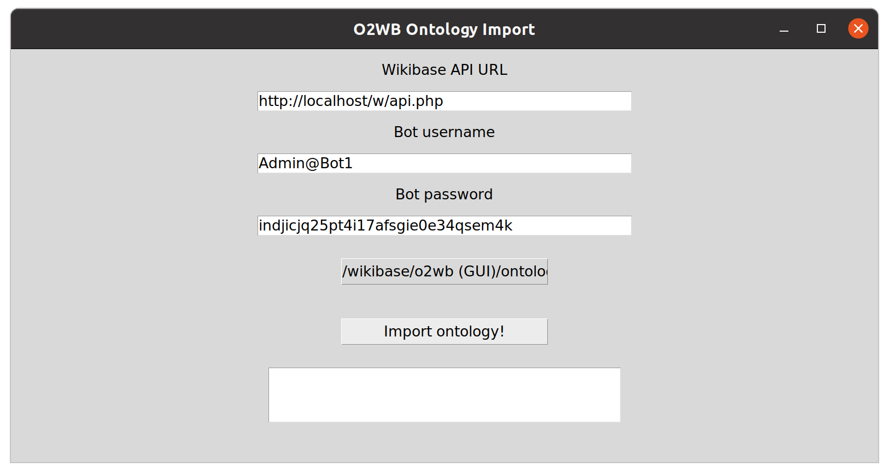

# O2WB

O2WB, a novel tool that enables ontology import into Wikibase.

## Getting started

1. Navigate to the root directory and install the required packages from requirements.txt
2. Create a new bot with full permissions in your Wikibase instance

## GUI option

3. Run importGUI.py

## Command-line option

3. Specify the bot name and password in config.json
4. Run import.py with the ontology file as script argument

## Other notes

- You can follow the import process through the Special Page "Last updates"
- To batch delete specific entries, run delete.py with specified start and end ID of the Entities to be deleted.
